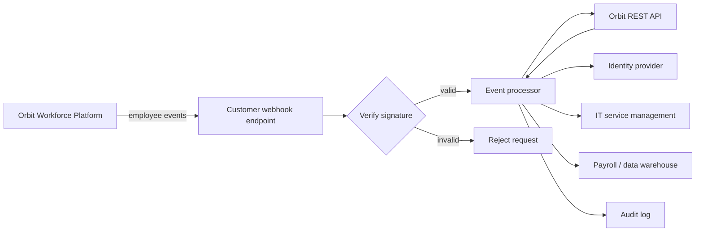

# Platform Integration Technical Writing Sample

This repository contains a documentation set for a fictional workforce SaaS product called **Orbit Workforce Platform**. The sample demonstrates how technical documentation can serve multiple audiences—from HR and IT administrators configuring a workflow to engineers implementing secure event-driven integrations.

The product and APIs described here are fictional. Company names, endpoints, identifiers, events, and example data are provided only for demonstration.

## Documentation set

| Document | Audience | Purpose |
| --- | --- | --- |
| [Automate employee lifecycle workflows](docs/employee-lifecycle-automation-guide.md) | HR/IT admins, implementation engineers | End-to-end implementation guide for event-driven employee lifecycle automation |
| [Webhook API reference](docs/webhooks-api-reference.md) | Developers | Endpoint and event reference, signature verification, retries, idempotency, and examples |
| [Migrate from polling to webhooks](docs/migrate-polling-to-webhooks.md) | Technical leads, developers | Migration strategy with coexistence, cutover, and rollback guidance |
| [Troubleshoot webhook delivery](docs/troubleshooting-webhook-delivery.md) | Developers, support engineers | Symptom-based diagnostic and recovery procedures |
| [Hands-on lab: build an onboarding listener](docs/hands-on-lab.md) | Developers, technical learners | Guided exercise that validates a working integration |
| [Permissions matrix](docs/permissions-matrix.md) | Admins, security reviewers | Least-privilege access model for configuration and operations |

## What this sample demonstrates

- Technical product documentation for a complex SaaS platform
- Audience-aware writing for business users and software engineers
- Developer documentation and REST/webhook reference content
- Product configuration and validation procedures
- API and integration testing workflows
- Secure webhook verification and replay protection
- Structured content, reusable terminology, and metadata
- Migration guidance and operational troubleshooting
- System diagrams and hands-on training material
- Documentation designed to improve self-service and reduce support dependency

## Scenario

Orbit Workforce Platform manages employee records, lifecycle status, organizational data, and application access. A customer wants to automate downstream actions when employees are hired, updated, placed on leave, or terminated.

The implementation uses Orbit webhooks for real-time events and Orbit REST APIs for authoritative record retrieval.



## Repository structure

```text
.
├── README.md
├── config/
│   └── content-variables.yml
├── docs/
│   ├── employee-lifecycle-automation-guide.md
│   ├── hands-on-lab.md
│   ├── migrate-polling-to-webhooks.md
│   ├── permissions-matrix.md
│   ├── troubleshooting-webhook-delivery.md
│   └── webhooks-api-reference.md
└── snippets/
    └── event-delivery-states.md
```

## Documentation conventions

Examples use the fictional base URL:

```text
https://api.orbit.example
```

Example credentials and secrets are placeholders. Never place production secrets in source control.

The procedures favor explicit validation steps and expected results so readers can confirm that an integration is working before enabling it in production.
