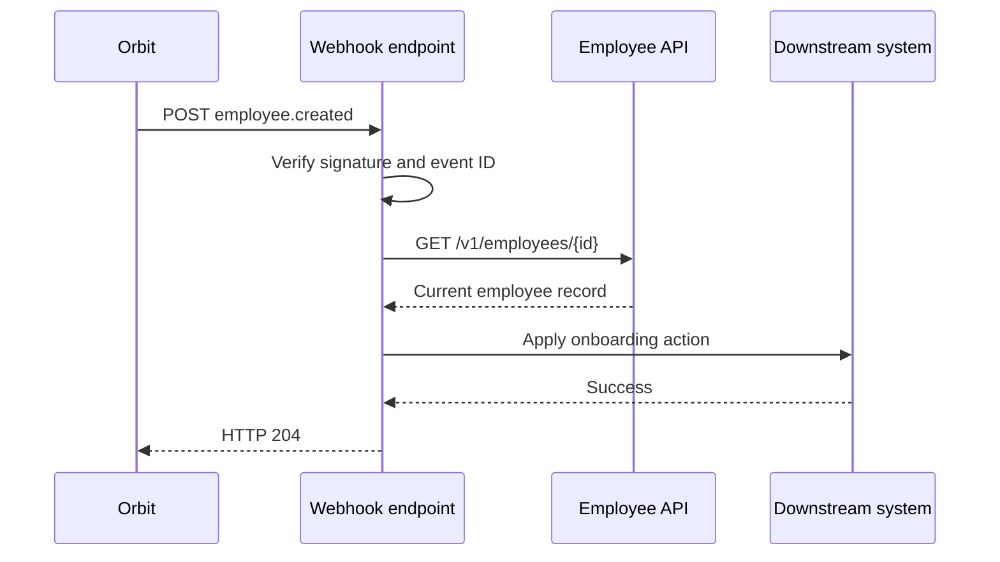
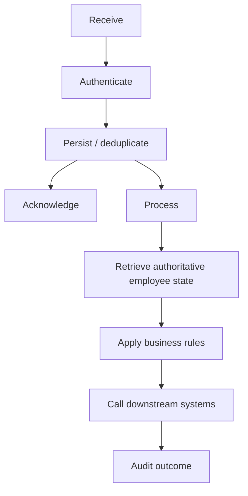

# Automate employee lifecycle workflows with webhooks

Employee lifecycle changes often trigger work across several systems. A new hire might require an identity account, laptop request, payroll enrollment, and application access. A termination might require the reverse sequence within minutes.

This guide shows how to use **Orbit Workforce Platform** webhooks and the Employee API to automate those workflows while preserving security, traceability, and reliable recovery.

## What you will build

You will configure Orbit to send lifecycle events to an HTTPS endpoint. Your integration will:

1. receive an employee event;
2. verify that Orbit sent it;
3. reject duplicate or replayed deliveries;
4. retrieve the current employee record from the Employee API;
5. apply downstream business logic; and
6. record the outcome for audit and troubleshooting.



## Before you begin

You need:

- an Orbit sandbox or test tenant;
- permission to manage webhook subscriptions;
- an HTTPS endpoint reachable from the public internet;
- an API credential with read access to employee records; and
- a non-production downstream system or test harness.

For production environments, use separate secrets and endpoints for development, test, and production.

## Choose the right event model

Use lifecycle events to tell you **that something changed**. Use the Employee API to retrieve the current authoritative record.

This separation prevents your integration from depending on every field being present in the event payload.

For example:

```json
{
  "id": "evt_01J8NQ9R4Y7",
  "type": "employee.created",
  "occurred_at": "2026-09-18T14:22:31Z",
  "data": {
    "employee_id": "emp_8d31fa"
  }
}
```

The event is intentionally small. Your application then retrieves:

```http
GET /v1/employees/emp_8d31fa
Authorization: Bearer <access-token>
```

This pattern also reduces problems when employee data changes between the event being generated and your application processing it.

## Supported lifecycle events

| Event | Typical use |
| --- | --- |
| `employee.created` | Begin onboarding workflows |
| `employee.updated` | Synchronize profile, manager, department, or location changes |
| `employee.leave_started` | Suspend or modify access during leave |
| `employee.leave_ended` | Restore appropriate access |
| `employee.termination_scheduled` | Prepare offboarding workflows |
| `employee.terminated` | Revoke access and complete offboarding |
| `employee.rehired` | Re-enable applicable lifecycle workflows |

Avoid treating every `employee.updated` event as actionable. Compare the current record with your stored state or inspect the event's `changed_fields` value when available.

## Step 1: Create a webhook endpoint

Your endpoint must:

- use HTTPS;
- accept `POST` requests;
- read the raw request body before JSON transformation;
- return a 2xx response only after the event has been accepted for processing; and
- respond within 10 seconds.

A minimal route might be:

```text
POST https://integrations.example.com/orbit/events
```

Return `204 No Content` when the event has been accepted.

Do not perform slow downstream work before acknowledging the request. Queue the event, return a response, and process the work asynchronously.

## Step 2: Create the subscription

In Orbit:

1. Open **Settings > Integrations > Webhooks**.
2. Select **Create subscription**.
3. Enter your HTTPS endpoint.
4. Select the lifecycle events required by your workflow.
5. Choose the environment.
6. Select **Create**.
7. Copy the signing secret and store it in your secret manager.

The signing secret is displayed once. Do not place it in source control, client-side code, screenshots, or ticket comments.

### Recommended subscription scope

For an onboarding integration, begin with:

```text
employee.created
employee.updated
employee.termination_scheduled
employee.terminated
```

Add leave or rehire events only if your downstream automation actually needs them.

## Step 3: Verify webhook signatures

Every delivery includes a timestamped signature in:

```text
X-Orbit-Signature
```

Example:

```text
t=1790253214,v1=18f20d2b2869f1d8f1a01f...
```

To verify the request:

1. read the timestamp from `t`;
2. concatenate the timestamp, a period, and the exact raw request body;
3. calculate an HMAC-SHA256 digest using the webhook signing secret;
4. compare your digest with the `v1` value using a constant-time comparison; and
5. reject timestamps outside your allowed tolerance.

Pseudo-code:

```text
signed_payload = timestamp + "." + raw_body
expected = HMAC_SHA256(secret, signed_payload)

if !constant_time_equal(expected, received_signature):
    reject
```

A five-minute timestamp tolerance is appropriate for most environments.

### Why raw-body verification matters

Do not parse and reserialize JSON before computing the signature. Whitespace, key order, and escaping can change during serialization and cause a valid request to fail verification.

## Step 4: Prevent duplicate processing

Webhook delivery is **at least once**. Your endpoint must be idempotent.

Each event has a stable event identifier:

```text
evt_01J8NQ9R4Y7
```

Store processed event IDs for at least the duration of your retry and replay window.

Before processing an event:

```text
if event_id already exists:
    return 204
else:
    record event_id
    process event
```

If your workflow creates a downstream resource, use a deterministic idempotency key such as:

```text
orbit:<event_id>:create-it-ticket
```

This prevents retries from creating duplicate tickets, accounts, or tasks.

## Step 5: Retrieve the employee record

Use the employee identifier from the event:

```bash
curl --request GET \
  --url https://api.orbit.example/v1/employees/emp_8d31fa \
  --header "Authorization: Bearer $ORBIT_ACCESS_TOKEN" \
  --header "Accept: application/json"
```

Example response:

```json
{
  "id": "emp_8d31fa",
  "status": "active",
  "name": {
    "given": "Jordan",
    "family": "Lee"
  },
  "work_email": "jordan.lee@example.com",
  "job": {
    "title": "Data Operations Analyst",
    "department": "Operations",
    "manager_id": "emp_719ca2",
    "location": "Toronto"
  },
  "employment": {
    "start_date": "2026-10-05",
    "type": "full_time"
  }
}
```

Validate the fields your downstream process requires. Do not assume optional fields are populated.

## Step 6: Apply business rules

Keep business rules separate from transport logic.

For example:

```text
WHEN employee.created
AND employment.type = full_time
AND job.location = Toronto
THEN
  create IT onboarding ticket
  request standard laptop
  add employee to Toronto office distribution group
```

This separation makes the integration easier to test because webhook receipt, record retrieval, and business decisions can be validated independently.

### Avoid hard-coded organizational values

Where practical, resolve departments, locations, and job families from configuration rather than embedding them throughout application code.

Prefer:

```yaml
locations:
  Toronto:
    device_profile: standard-ca
    identity_group: toronto-office
```

over repeated conditional logic.

## Step 7: Test with a sample event

From the webhook subscription page, select **Send test event**.

Confirm all of the following:

- your endpoint receives the request;
- signature verification succeeds;
- the event ID is recorded;
- your application retrieves the employee record;
- the expected downstream test action occurs;
- your application returns a 2xx response; and
- Orbit marks the delivery as `delivered`.

Record the event ID during testing. It lets you correlate Orbit delivery history with your own logs.

## Step 8: Validate failure behavior

A production-ready integration needs intentional failure tests.

### Test an invalid signature

Send a request with a modified body but the original signature.

Expected result:

```text
HTTP 401
```

The event must not enter your processing queue.

### Test a duplicate event

Send the same valid event twice.

Expected result:

- first request: accepted and processed;
- second request: acknowledged but not processed again.

### Test downstream unavailability

Temporarily make the test downstream service return an error.

Expected result:

- your endpoint still safely queues the Orbit event;
- your internal retry mechanism handles the downstream failure;
- no duplicate side effect occurs.

### Test API authorization failure

Use an expired or revoked API credential.

Expected result:

- employee retrieval fails;
- the event remains recoverable;
- logs identify the failed API request without exposing credentials.

## Step 9: Monitor delivery health

Track at least:

| Metric | Why it matters |
| --- | --- |
| Delivery success rate | Detect endpoint or authentication failures |
| p95 acknowledgment latency | Detect slow webhook handlers |
| Signature validation failures | Identify configuration errors or suspicious traffic |
| Duplicate event rate | Validate idempotency behavior |
| Processing success rate | Separate delivery health from workflow health |
| Processing latency | Measure time from lifecycle change to downstream completion |
| Replay count | Identify recurring recovery or stability problems |

A successful webhook delivery does not necessarily mean the downstream business workflow succeeded. Monitor both layers.

## Step 10: Prepare for production

Before production cutover:

- use a dedicated production subscription;
- rotate any secrets used during development;
- verify least-privilege API permissions;
- configure alerting;
- test replay procedures;
- define an operational owner;
- document downstream dependencies; and
- confirm rollback behavior.

Do not reuse a sandbox webhook signing secret in production.

## Operational model

A reliable integration separates four concerns:



This design allows Orbit delivery to remain fast while downstream failures can be retried independently.

## Security recommendations

Use these controls in production:

- store API credentials and signing secrets in a secret manager;
- enforce TLS;
- validate every webhook signature;
- reject stale timestamps;
- use least-privilege API scopes;
- avoid logging full employee payloads unless required;
- redact credentials and sensitive values from errors;
- restrict access to delivery and audit logs;
- rotate secrets periodically; and
- retain event identifiers for replay protection.

## When to use polling instead

Webhooks are not ideal for every workload.

Use scheduled API polling when:

- your use case is a periodic full reconciliation;
- real-time notification is unnecessary;
- a downstream system can tolerate delayed updates; or
- you need to compare the complete source dataset with a destination.

Many production integrations use both:

**webhooks for low-latency changes + scheduled reconciliation for completeness.**

## Next steps

- Read the [Webhook API reference](webhooks-api-reference.md).
- Follow [Migrate from polling to webhooks](migrate-polling-to-webhooks.md) if you have an existing integration.
- Use [Troubleshoot webhook delivery](troubleshooting-webhook-delivery.md) during implementation.
- Complete the [hands-on onboarding listener lab](hands-on-lab.md) to validate the workflow end to end.
