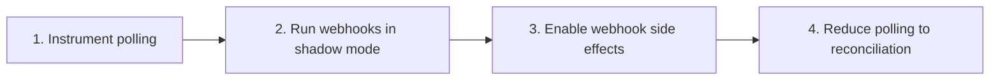

# Migrate from polling to webhooks

This guide describes how to migrate an existing employee synchronization process from periodic API polling to event-driven webhook processing.

The migration uses a coexistence period so you can validate event completeness before disabling the legacy poller.

## Why migrate

Polling is appropriate for reconciliation but inefficient for low-latency workflows.

A polling integration might:

```text
Every 15 minutes
    GET employees updated since last_run
    compare records
    process changes
```

A webhook integration instead receives changes shortly after they occur.

Benefits include:

- lower change-detection latency;
- fewer unnecessary API requests;
- better separation between change notification and reconciliation;
- more precise operational visibility; and
- simpler event-by-event auditing.

Keep periodic reconciliation even after migration if downstream correctness requires eventual completeness.

## Migration strategy

Use four phases:



## Phase 1: Instrument the existing poller

Before introducing webhooks, establish a baseline.

Record:

- records evaluated per poll;
- changes detected;
- average detection delay;
- failed synchronizations;
- duplicate side effects;
- API request volume; and
- time required for recovery after failures.

Add a stable correlation identifier to every synchronization action.

## Phase 2: Run webhooks in shadow mode

Create a sandbox or production webhook subscription, but do not let webhook processing modify downstream systems yet.

For each webhook event:

1. verify the signature;
2. persist the event ID;
3. retrieve the employee record;
4. calculate the action that would have occurred;
5. write the result to a comparison log; and
6. return a successful response.

Continue running the existing poller normally.

### Compare both paths

For each employee change, compare:

| Attribute | Polling path | Webhook path |
| --- | --- | --- |
| Change detected | Yes/No | Yes/No |
| Detection time | Timestamp | Timestamp |
| Employee ID | Value | Value |
| Calculated action | Value | Value |
| Downstream effect | Executed | Shadow only |

Investigate any mismatch before cutover.

## Phase 3: Enable webhook side effects

After shadow-mode validation, enable downstream actions for webhook events.

Temporarily leave the poller running with side effects suppressed for records already handled by webhooks.

A shared processing ledger can prevent duplicates:

```text
source_change_key
employee_id
event_id
processed_at
action
status
```

For webhook events, use the Orbit event ID as the primary deduplication identifier.

For polled changes, use a deterministic key derived from the employee ID and source update timestamp.

## Phase 4: Convert polling to reconciliation

After the webhook path is stable, stop using polling as the primary trigger.

Instead, run reconciliation at a lower frequency, such as once every 24 hours.

The reconciliation job should:

1. retrieve employees changed during the reconciliation window;
2. compare Orbit state with downstream state;
3. identify missing or inconsistent updates;
4. repair safe discrepancies automatically; and
5. surface ambiguous differences for review.

## Cutover checklist

Before cutover, confirm:

- webhook success rate is within your target;
- signature failures are understood;
- duplicate events are handled safely;
- event processing is observable;
- failed events can be replayed;
- API credentials have correct production scopes;
- your queue can survive temporary downstream outages;
- business owners have approved cutover; and
- rollback has been tested.

## Rollback

If webhook processing causes incorrect downstream changes:

1. disable the webhook subscription or disable side effects in your application;
2. preserve received events for investigation;
3. re-enable the previous polling workflow;
4. reconcile the affected time window;
5. identify the failure mode; and
6. return to shadow mode before attempting cutover again.

Do not delete failed event records during rollback. They are important for root-cause analysis and recovery.

## Success criteria

A migration is complete when:

- webhooks are the primary change trigger;
- polling is limited to reconciliation;
- duplicate side effects are prevented;
- alerting covers delivery and processing failures;
- operational teams can replay events safely; and
- measured detection latency meets the business requirement.
